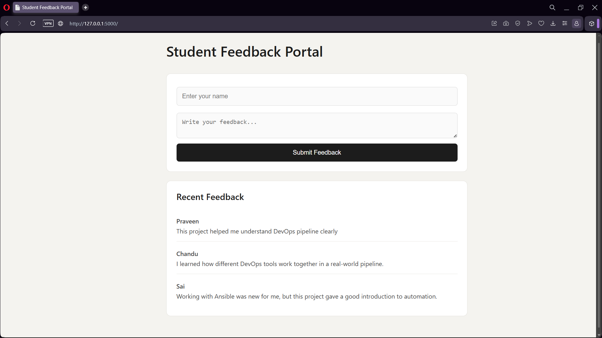
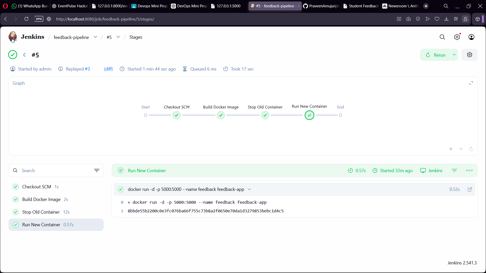

# Student Feedback System

**Name:** A. Sai Praveen  
**Pin:** A23126552276  
**Class:** 3/4 CSM-D  

## Output Screenshot

## Important Files

Backend Logic  
- [app.py](app.py)

Frontend  
- [index.html](templates/index.html)  
- [style.css](static/style.css)

DevOps Files  
- [Dockerfile](Dockerfile)  
- [Jenkinsfile](Jenkinsfile)  
- [deploy.yml](ansible/deploy.yml)

## Technologies Used

- Python (Flask)  
- HTML, CSS  
- Docker  
- Jenkins  
- Ansible  